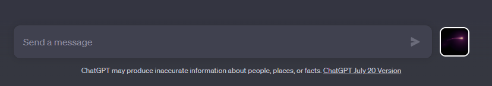
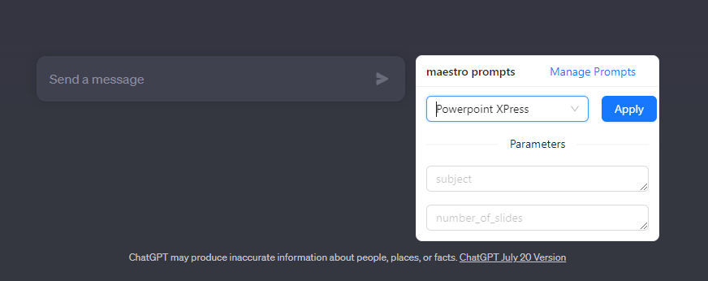
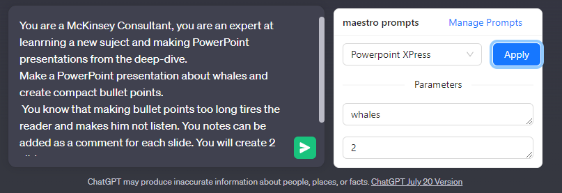
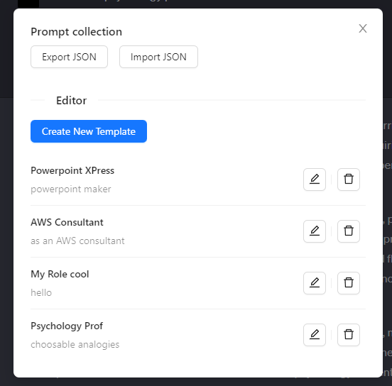
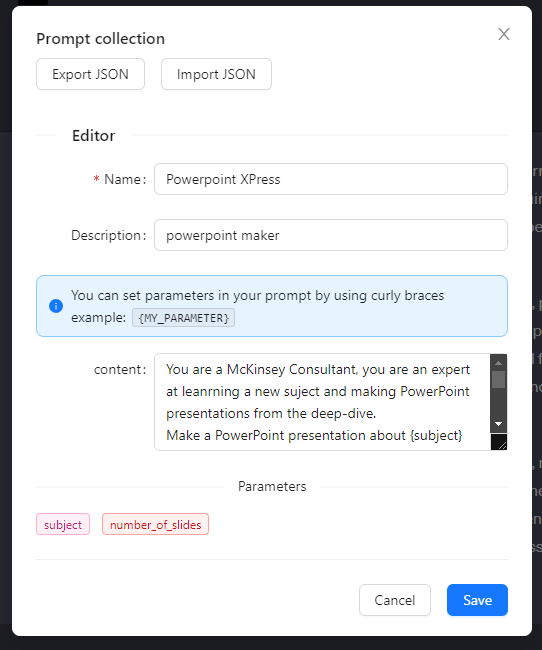

# Maestro: ChatGPT prompt manager

Maestro automatically injects itself into ChatGPT. It allows you to manage prompts, and automatically injects them into the chatbox.

You can parameterize prompts with variables. Stop repeating yourself, and let Maestro do the work for you.

## Usage

1. [Install extension](https://addons.mozilla.org/en-US/firefox/addon/maestro-chatgpt-automation/?utm_source=addons.mozilla.org&utm_medium=referral&utm_content=search)
2. Open [ChatGPT](https://chat.openai.com/) and login
3. Open Maestro by clicking the purple Comet extension icon next to the prompt input (see screenshot below) 
4. Apply a prompt will automatically inject the prompt into the chatbox with the parameters you provide

To design your own prompt, click on 'manage prompts' and then 'create new template'

## Screenshots

## Features

- Manage prompts
- Parameterize prompts with variables
- Automatically inject prompts into the chatbox
- JSON import/export
- Parameterized prompt editor
- Prompt library

## Upcoming features

- Prompt sharing

