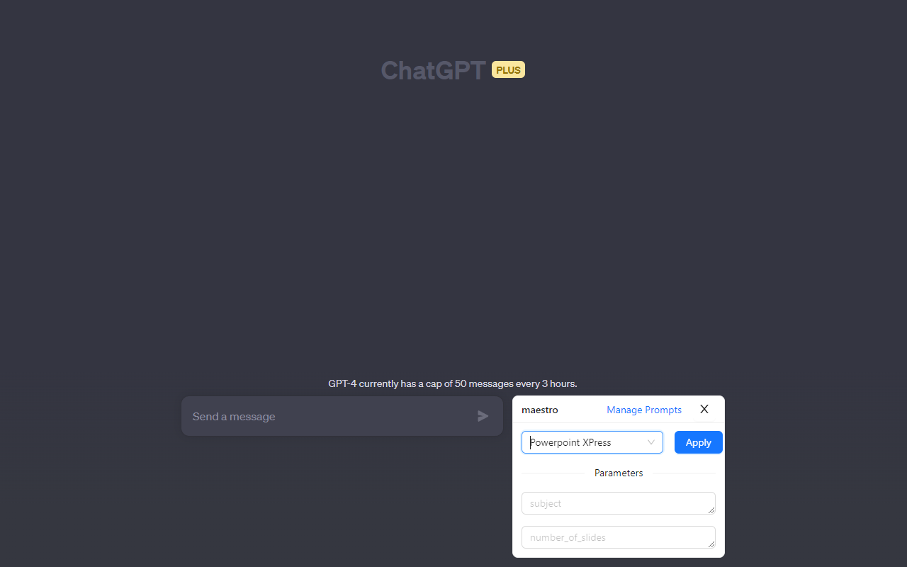
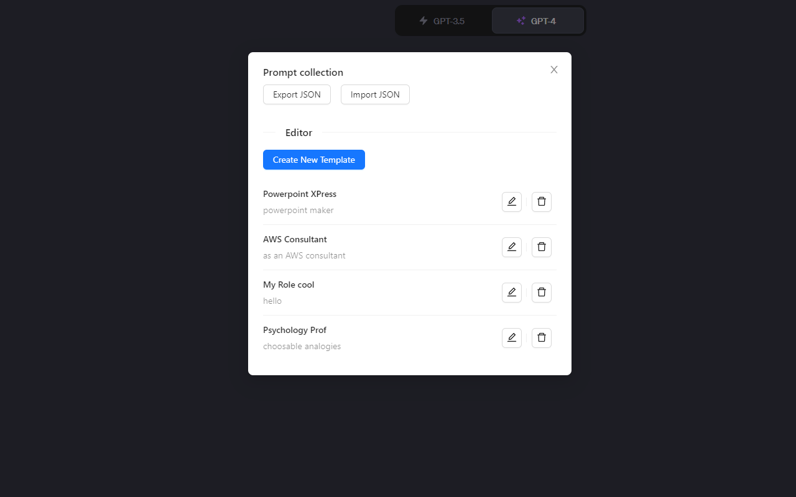
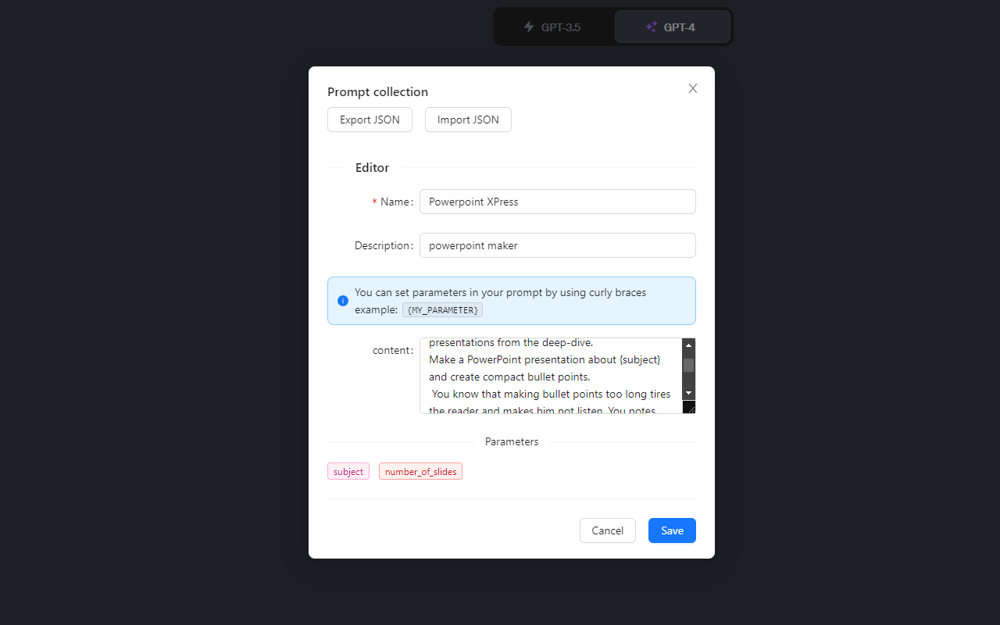

# Maestro: ChatGPT prompt manager

Maestro is a prompt automator/manager for ChatGPT. Maestro allows you to write, manage, and execute prompt templates. 
You can run prompt templates with parameters to increase the efficiency of your ChatGPT workflows.

Stop repeating yourself, and let Maestro do the work for you.

## Usage

1. [Install extension](https://addons.mozilla.org/en-US/firefox/addon/maestro-chatgpt-automation/?utm_source=addons.mozilla.org&utm_medium=referral&utm_content=search)
2. Open [ChatGPT](https://chat.openai.com/) and login
3. Open Maestro by clicking the purple Comet extension icon next to the prompt input (see screenshot below) 
4. Apply a prompt template, Maestro will paste the prompt into the chatbox with the parameters you provide.

To design your own prompt, click on 'manage prompts' and then 'create new template'.

[See full guide](https://gtestault.github.io/maestro-chatGPT/) for more details.

## Screenshots

## Features

- Manage prompts
- Parameterize prompts with variables
- Automatically inject prompts into the chatbox
- JSON import/export
- Parameterized prompt editor
- Prompt library

