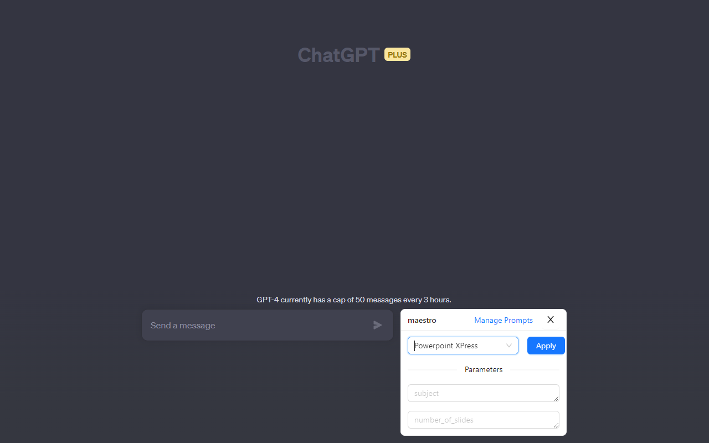
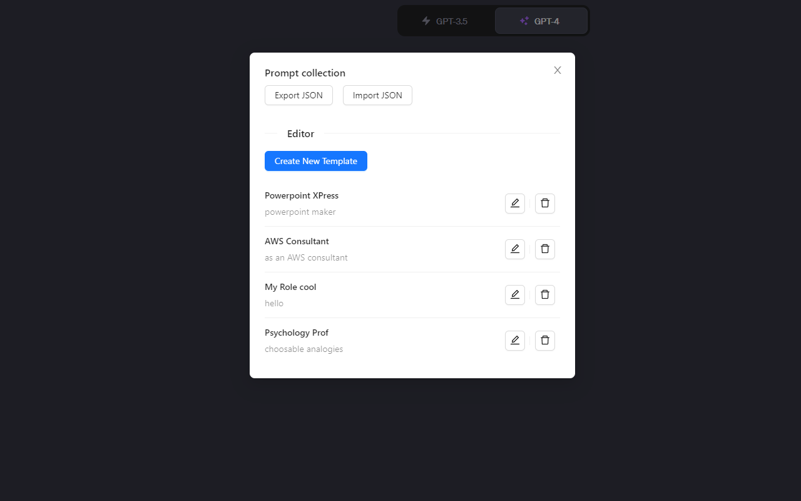
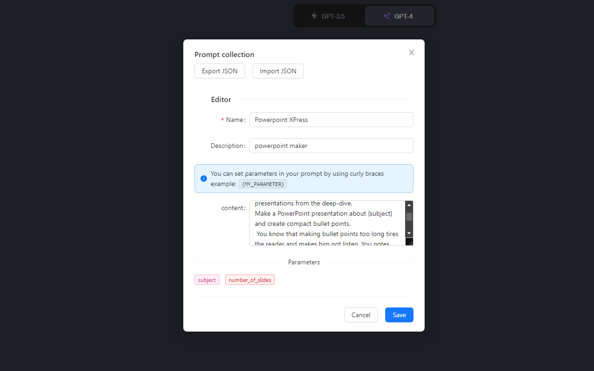

# User guide

Welcome to Maestro. Maestro is a prompt template manager for ChatGPT. It allows you to manage prompts, and automatically inject them with parameters into the chatbox. 

## Using a prompt template 

1. Open [ChatGPT](https://chat.openai.com/) and login
2. Open Maestro by clicking the purple Comet extension icon next to the prompt input (see screenshot below)

3. Select a prompt template from the dropdown menu

4. Fill in the parameters for the prompt template
5. Click 'Apply prompt'

## Writing your own prompt template

1. Open Maestro
2. Click on 'Manage Prompts', You will now see a list of all your prompt templates

3. Click on 'Create New template'
4. In the editor, give your prompt template a name and a description. The content of the prompt template is the prompt that will be injected into the chatbox. You can parameterize the prompt with parameters.
To do so, use the following syntax: `{my_parameter}`. For example, if you want to parameterize the prompt with a variable called `name`, you would write `{name}` in the content field.

