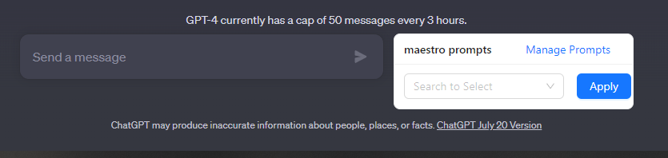
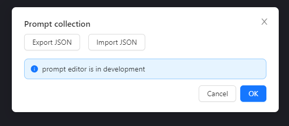

# Usage guide

All prompt templates are written in JSON. 
JSON is a format that is easy for both humans and machines to read and write.
In the future, we will provide a GUI for editing prompt templates.

## 1. Writing prompts 

### 1.1. Prompt library structure

The prompt library is a JSON array of prompt templates. 
Here is a full example for a prompt template library. 


```json
[
    {
        "name": "AWS Consultant",
        "description": "roleplay as an AWS consultant",
        "content": "You are a certified AWS Cloud Architect. Q: {question}",
        "variables": [
            {
                "name": "question",
                "description": "AWS related question"
            }
        ]
    }
]
```
Each element (or prompt template) in the library must adhere to the following structure:

- `name`: (Required) A string that represents the name of the prompt.
- `description`: (Optional) A string that provides a brief explanation of the prompt.
- `content`: (Required) A string that forms the body of the prompt. It may contain variables enclosed in curly braces, e.g., `{my_variable}`.
- `variables`: (Required only when variables in content) An array of variable objects that must be defined if there are any variables present in the `content` field. Each variable object should at least have a `name`. A `description` for each variable is optional but recommended for clarity.

### 1.2. Using variables in prompts

Variables in prompts allow for dynamic content. These are represented as `{variable_name}` inside the `content` field.

If your `content` includes variables, they must be defined in the `variables` block. The `variables` block is an array, where each object represents a different variable used in the content. Each variable object must have a `name` attribute and can optionally have a `description`.

```json
{
    "name": "question",
    "description": "An AWS-related question that the user is expected to answer."
}
```

If there are no variables used in your `content`, the `variables` block can be omitted.

## 2. Requirements

### 2.1. For top-level prompt template

For every top-level prompt template, the following fields are required:

- `name`: The name of the prompt.
- `content`: The main body of the prompt.

```json
{
    "name": "AWS Consultant",
    "content": "You are a certified AWS Cloud Architect. Q: {question}"
}
```

### 2.2. For variables in the text

If there are variables in the `content` of your prompt, the following field is required for each variable:

- `name`: The name of the variable, as it appears in the `content`.

```json
"variables": [
    {
        "name": "question"
    }
]
```

Remember, if there are no variables in your content, you can omit the `variables` block entirely.


## 3. Import/Export 

### 3.1. Importing prompt template library

On chat.openai.com, maestro appears next to the chatbox. 




To open the library editor, click on 'Manage Prompts' button.



Here you can import a prompt template library by clicking on the 'Import' button.
You can also export the prompt template library by clicking on the 'Export' button.
